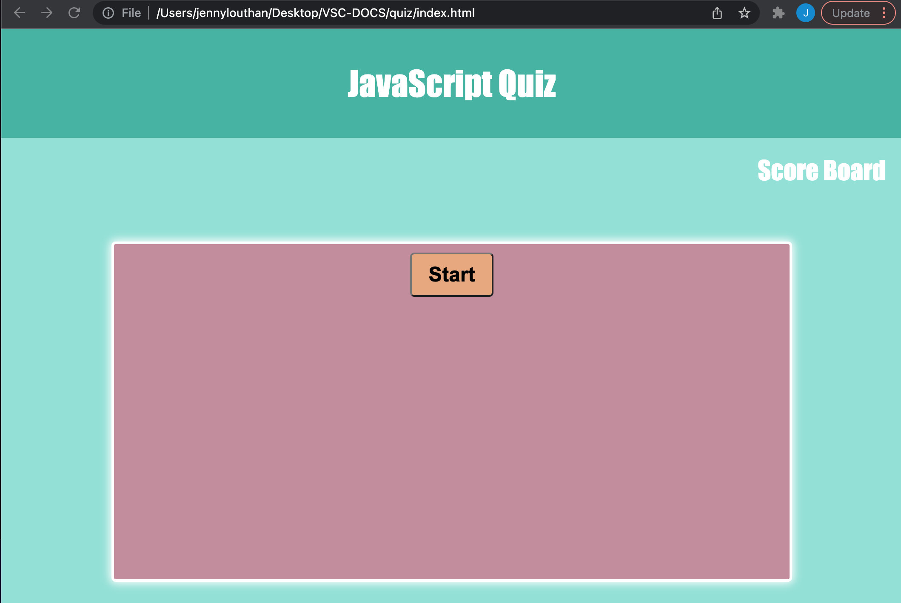

# JavaScript Quiz
## <Project Quiz>

## Table of Contents 

* [Description](#description)

* [LinkToSite](#LinkToSite)

* [Questions](#questions)

## Description

We were tasked with building a JavaScript Quiz. To meet the requirements we needed to create a page with a start button. Once clicking the start button a timer starts and the first question is presented. The user selects an answer and if it is wrong, loses time on the clock.  When the user completes the quiz by answering all of the questions - or - the timer reaches zero, the game is over. The user is then directed to a window or new page where they enter their initials that input into a high scores page. 
I ran into a lot of challenges on this assignment and it is very close to being complete, while I understand it is not 100% complete. There are a few bugs that I would like to learn more about and how to fix given more time. For example, once the user is on the High Scores page, I would like the high scores to display (right now, they do not) and with the number of correct answers and the time left remaining. 

Link to Github: https://github.com/jennyrae818/quiz

## LinkToSite
<https://jennyrae818.github.io/quiz/>

## Questions

If you have any questions about the repo, open an issue or contact [jenny](undefined) directly at jennyrae818@gmail.com.